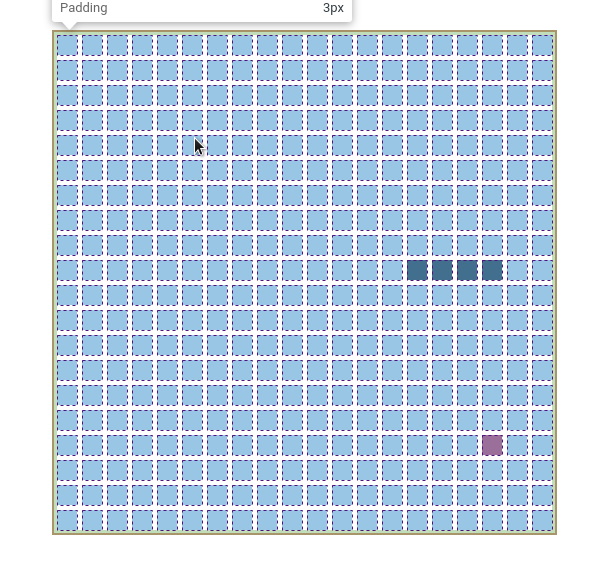

# CSS Snake Grid

A snake implementation with `display: grid` and using divs. Made in svelte.

Plugged the basic keyboard arrow listeners and snake-stack movement.

## Running

- `git clone <this_repo>`
- `yarn`
- `yarn dev`

## CSS Grid

- js

```js
let snakeBody = [
  { x: 7, y: 10 },
  { x: 8, y: 10 },
  { x: 9, y: 10 },
  { x: 10, y: 10 }
];

let apple = {
  x: Math.floor(Math.random() * 20),
  y: Math.floor(Math.random() * 20)
};
```

- css:

```css
#rootGrid {
  display: grid;
  grid-template-columns: repeat(20, 20px);
  grid-template-rows: repeat(20, 20px);
  grid-gap: 5px;

  border-color: black;
  border-width: 2px;
  border-style: solid;
  padding: 3px;
}

.snakePart {
  background-color: black;
}

#apple {
  background-color: red;
}
```

- svelte

```html
<div id="rootGrid">
  {#each snakeBody as snake}
  <div
    class="snakePart"
    style="grid-column: {snake.x} / {snake.x + 1}; grid-row: {snake.y} / {snake.y + 1};"
  />
  {/each}

  <div
    id="apple"
    style="grid-column: {apple.x} / {apple.x + 1}; grid-row: {apple.y} / {apple.y + 1};"
  />
</div>
```

- Gridlike show:


